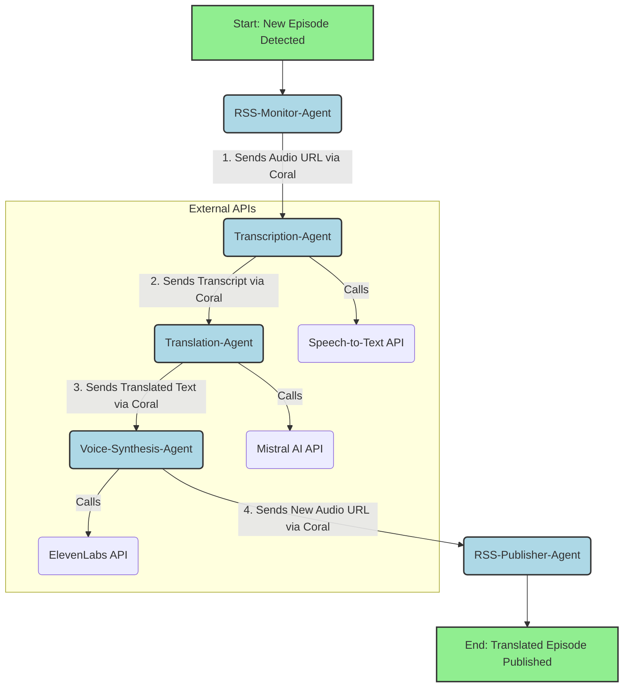

# 🏓 Global Podcaster App
`Global Podcaster App` is a multi-agent pipeline that fetches podcast audio from any RSS feed, transcribes it to text using Deepgram, and translates the transcript to your target language using Mistral AI—all orchestrated via Coral Protocol.  
This project demonstrates how to build composable, language-agnostic agent workflows for global podcast accessibility and discovery.

## 🛠️ How the Automated Feed Monitoring Works

### feeds.txt: Managing RSS Feeds
- The `feeds.txt` file contains one RSS feed URL per line.
- You can add or remove feeds at any time. Lines starting with `#` are comments and ignored.
- Example:
  ```
  https://feeds.npr.org/500005/podcast.xml
  https://feeds.megaphone.fm/sciencevs
  #https://another-feed.com/rss
  ```

### seen_episodes files
- For each RSS feed, the system creates a state file named `seen_episodes_<hash>.json`.
- This file stores the identifiers of episodes already processed for that feed, preventing duplicate processing.
- You can delete these files to force reprocessing of all episodes for a feed.

### Monitoring process
- The `monitor_feeds.py` script reads all URLs from `feeds.txt` and, every 2 minutes, runs the pipeline for each feed.
- The pipeline flow is:
  1. **rss-monitor-agent**: Detects new (unseen) episodes for each feed.
  2. **rss-fetch-agent**: Fetches metadata for all episodes in the feed.
  3. **transcription-agent**: Transcribes the audio of each new episode using Deepgram.
  4. **translation-agent**: Translates the transcript using Mistral AI.
  5. The final result is a JSON with title, audio_url, transcript, and translation for each new episode.

### Customization
- You can change the monitoring interval by editing the `POLL_INTERVAL` variable in `monitor_feeds.py` (value in seconds).
- You can add/remove feeds at any time by editing `feeds.txt`.

### Notes
- If an episode is very long, the translation may be limited by the `max_tokens` parameter in the translation agent.
- To reset tracking for a feed, delete its corresponding `seen_episodes_<hash>.json` file.

Of course. Here are the detailed diagrams for the **"Global Podcaster"** app, illustrating both the specific agent-to-agent workflow and the complete system architecture.

-----

## 1\. Agent Flow Diagram

This diagram shows the step-by-step pipeline of how a new podcast episode is processed. The entire flow is orchestrated by **Coral Protocol**, which passes a job from one specialized agent to the next until the process is complete.



### **Flow Breakdown:**

1.  **`RSS-Monitor-Agent`** detects a new episode and initiates the workflow by passing the original audio URL to the next agent.
2.  **`Transcription-Agent`** receives the audio, converts it to text using a Speech-to-Text API, and passes the resulting transcript onward.
3.  **`Translation-Agent`** takes the transcript, translates it using **Mistral AI**, and sends the translated text to the synthesis agent.
4.  **`Voice-Synthesis-Agent`** uses the podcaster's cloned voice on **ElevenLabs** to convert the translated text into a new audio file.
5.  **`RSS-Publisher-Agent`** takes the final audio file URL and all the translated metadata (title, description) and updates the new, language-specific RSS feed.

-----

## 2\. Full Application Architecture Diagram

This diagram provides a high-level overview of the entire system, showing how the user, frontend, backend, agents, and external services all interact.

```mermaid
graph LR
    subgraph User Interaction
        User[Podcaster] -- Interacts via Browser --> Frontend[Frontend Web App <br> (React/Vue)];
    end

    subgraph Your Application Infrastructure
        Frontend -- HTTPS API Calls --> Backend[Backend Orchestrator <br> (Node.js/Python)];
        Backend <--> DB[(Database <br> Users, RSS Feeds, Voice IDs)];
        Backend -- Initiates Job --> Coral;
        
        subgraph Coral Protocol Network
            Coral[Agent Network <br> (Coral Protocol)];
            Agent1[RSS-Monitor-Agent];
            Agent2[Transcription-Agent];
            Agent3[Translation-Agent];
            Agent4[Voice-Synthesis-Agent];
            Agent5[RSS-Publisher-Agent];
        end

        Coral -.-> Agent1;
        Coral -.-> Agent2;
        Coral -.-> Agent3;
        Coral -.-> Agent4;
        Coral -.-> Agent5;
    end

    subgraph External Services
        Agent3 -- API Call --> Mistral[Mistral AI];
        Agent4 -- API Call --> ElevenLabs[ElevenLabs];
        Agent2 -- API Call --> STT[AI/ML API <br> (Speech-to-Text)];
    end

    style User fill:#D3D3D3,stroke:#333,stroke-width:2px
    style Frontend fill:#FFFACD,stroke:#333,stroke-width:2px
    style Backend fill:#FFFACD,stroke:#333,stroke-width:2px
    style DB fill:#FFFACD,stroke:#333,stroke-width:2px
    style Agent1 fill:#ADD8E6,stroke:#333,stroke-width:1px
    style Agent2 fill:#ADD8E6,stroke:#333,stroke-width:1px
    style Agent3 fill:#ADD8E6,stroke:#333,stroke-width:1px
    style Agent4 fill:#ADD8E6,stroke:#333,stroke-width:1px
    style Agent5 fill:#ADD8E6,stroke:#333,stroke-width:1px
    style Mistral fill:#FFDDC1,stroke:#333,stroke-width:1px
    style ElevenLabs fill:#FFDDC1,stroke:#333,stroke-width:1px
    style STT fill:#FFDDC1,stroke:#333,stroke-width:1px
```

### **Architecture Breakdown:**

  * **User Interaction:** The podcaster interacts only with the **Frontend**, which is a clean, simple web interface for managing their account and podcasts.
  * **Your Application Infrastructure:**
      * The **Frontend** communicates with your **Backend** via a standard REST or GraphQL API.
      * The **Backend** is the central brain. It handles user data, stores information in the **Database**, and most importantly, it acts as the **Orchestrator**. It is the only part of your system that directly tells the **Coral Protocol Network** to start a new job.
      * The **Coral Protocol Network** is the communication layer for your agents. It ensures that jobs are passed reliably from one agent to the next. The agents themselves can be hosted as independent serverless functions.
  * **External Services:** These are the third-party AI platforms that provide the core intelligence. Your agents are responsible for calling these APIs with the correct data and handling their responses.


```
## 🚀 Getting Started
### Manual Setup
> only the first time
#### Clone the Coral Multi-Agent Demo repository:
```bash
git clone https://github.com/Coral-Protocol/Multi-Agent-Demo coral
cd coral
```
#### Install dependencies
```bash
./check-dependencies.sh
```

### (Optional) Install ngrok in codespace
> Only if you want to make the Coral Server and Coral Discovery URLs public so that the entire team uses the same Coral server.
#### Install ngrok
```bash
curl -s https://ngrok-agent.s3.amazonaws.com/ngrok.asc | sudo tee /etc/apt/trusted.gpg.d/ngrok.asc >/dev/null
echo "deb https://ngrok-agent.s3.amazonaws.com buster main" | sudo tee /etc/apt/sources.list.d/ngrok.list
sudo apt update
sudo apt install ngrok
```

#### ngrok authentication

```bash
# Register on: ngrok.com and copy your authtoken.
ngrok config add-authtoken YOUR_AUTHTOKEN
```

### Start Coral server and studio
In one terminal, start `coral server`:
```bash
cd coral
./start-server.sh
```

In other terminal, start `coral studio`:
```bash 
cd coral
./start-studio.sh
```

#### (Optional) Expose coral server port
> Only for external access
```bash
ngrok http 5555
```
> use the public address to conect the server on `Coral Discovery`

### Nota importante para Coral Studio y servidores públicos

Si necesitas conectar Coral Studio a un servidor Coral expuesto mediante HTTPS (por ejemplo, usando ngrok), debes permitir que el campo de host acepte URLs completas (con http o https). Por defecto, Coral Studio solo usaba http, lo que causaba errores de "mixed content" en navegadores modernos.

**Solución aplicada:**

En el archivo `coral/coral-studio/src/lib/components/server-switcher.svelte`, se ha modificado la línea que realiza la petición de test de conexión:

**Antes:**
```js
const res = await fetch(`http://${host}/api/v1/registry`);
```

**Después:**
```js
// Si el host ya incluye http o https, úsalo tal cual; si no, añade http:// por compatibilidad retro.
let url = host.startsWith('http://') || host.startsWith('https://')
	? host
	: `http://${host}`;
const res = await fetch(`${url}/api/v1/registry`);
```

Esto permite introducir la URL completa (por ejemplo, `https://xxxx.ngrok-free.app`) al añadir un server en Coral Studio, solucionando problemas de seguridad y permitiendo conexiones remotas seguras.

**Cambio adicional necesario:**

En el archivo `coral/coral-studio/src/lib/components/app-sidebar.svelte`, también es necesario modificar las llamadas al registry y a las sesiones para que usen el protocolo correcto (http o https) según lo introducido en el host.

**Antes:**
```js
const agents = (await fetch(`http://${sessCtx.connection.host}/api/v1/registry`).then((res) => res.json())) as RegistryAgent[];
const sessions = (await fetch(`http://${sessCtx.connection.host}/api/v1/sessions`).then((res) => res.json())) as string[];
```

**Después:**
```js
let url = sessCtx.connection.host.startsWith('http://') || sessCtx.connection.host.startsWith('https://')
	? sessCtx.connection.host
	: `http://${sessCtx.connection.host}`;
const agents = (await fetch(`${url}/api/v1/registry`).then((res) => res.json())) as RegistryAgent[];
const sessions = (await fetch(`${url}/api/v1/sessions`).then((res) => res.json())) as string[];
```

Esto asegura que todas las llamadas al registry y a las sesiones respeten el protocolo introducido, evitando errores de mixed content y permitiendo conexiones seguras.

**Cambio adicional para la creación de sesiones:**

En el archivo `coral/coral-studio/src/lib/components/dialogs/create-session.svelte`, también es necesario modificar la llamada para crear sesiones para que use el protocolo correcto (http o https) según lo introducido en el host.

**Antes:**
```js
const res = await fetch(`http://${ctx.connection.host}/sessions`, { ... });
```

**Después:**
```js
let url = ctx.connection.host.startsWith('http://') || ctx.connection.host.startsWith('https://')
	? ctx.connection.host
	: `http://${ctx.connection.host}`;
const res = await fetch(`${url}/sessions`, { ... });
```

Esto garantiza que la creación de sesiones también respete el protocolo introducido, evitando errores de mixed content y permitiendo conexiones seguras.

**Cambio adicional para WebSocket seguro:**

En el archivo `coral/coral-studio/src/lib/session.svelte.ts`, es necesario modificar la construcción de la URL del WebSocket para que use `wss://` si la página está en HTTPS.

**Antes:**
```js
this.socket = new WebSocket(
	`ws://${host}/debug/${appId}/${privacyKey}/${session}/?timeout=10000`
);
```

**Después:**
```js
const wsProtocol = window.location.protocol === 'https:' ? 'wss://' : 'ws://';
this.socket = new WebSocket(
	`${wsProtocol}${host}/debug/${appId}/${privacyKey}/${session}/?timeout=10000`
);
```

Esto evita errores de seguridad en navegadores modernos y permite la conexión de Coral Studio a través de HTTPS.

**Corrección final para WebSocket seguro:**

En el archivo `coral/coral-studio/src/lib/session.svelte.ts`, es necesario eliminar cualquier prefijo `http://` o `https://` del host antes de anteponer `wss://` o `ws://` al construir la URL del WebSocket.

**Antes:**
```js
const wsProtocol = window.location.protocol === 'https:' ? 'wss://' : 'ws://';
this.socket = new WebSocket(
	`${wsProtocol}${host}/debug/${appId}/${privacyKey}/${session}/?timeout=10000`
);
```

**Después:**
```js
let cleanHost = host.replace(/^https?:\/\//, '');
const wsProtocol = window.location.protocol === 'https:' ? 'wss://' : 'ws://';
this.socket = new WebSocket(
	`${wsProtocol}${cleanHost}/debug/${appId}/${privacyKey}/${session}/?timeout=10000`
);
```

Esto evita URLs mal formadas como `wss://https//...` y garantiza la compatibilidad con servidores públicos y entornos seguros.


### If you are using codespaces but do not want to use ngrok
- Copy the files in /temp to the corresponding locations in /coral, overwriting the existing ones.
- You must make the coral server and coral studio ports public.
- Then, in the coral studio console, use the public address of the coral server.

### 🔑 API Keys and Environment Variables
For the transcription agent to work with Deepgram, you need a valid API key. Create a `.env` file in the root of the project with the following content:

```env
DEEPGRAM_API_KEY=your_deepgram_api_key_here
```
This variable will be automatically read by the transcription agent. If it is missing or incorrect, transcription will fail.

### Translation Agent: Mistral AI API Key

To use the translation agent with Mistral AI, you need a valid API key. Add the following line to your `.env` file in the root of the project:

```env
MISTRAL_API_KEY=your_mistral_api_key_here
```

This variable will be automatically read by the translation agent. If it is missing or incorrect, translation will fail.

### How to run
1. Open in GitHub Codespaces / devcontainer or locally
2. Install dependencies: `pip install -r requirements.txt`
3. Run monitor: `python3 monitor_feeds.py`

> The monitor prints to the console how many feeds are pending and the progress for each one.
> State files and results are stored in the project root directory.