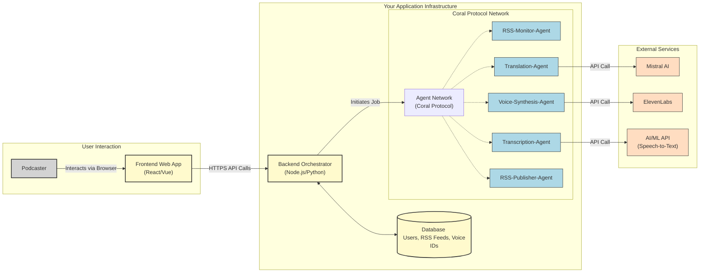
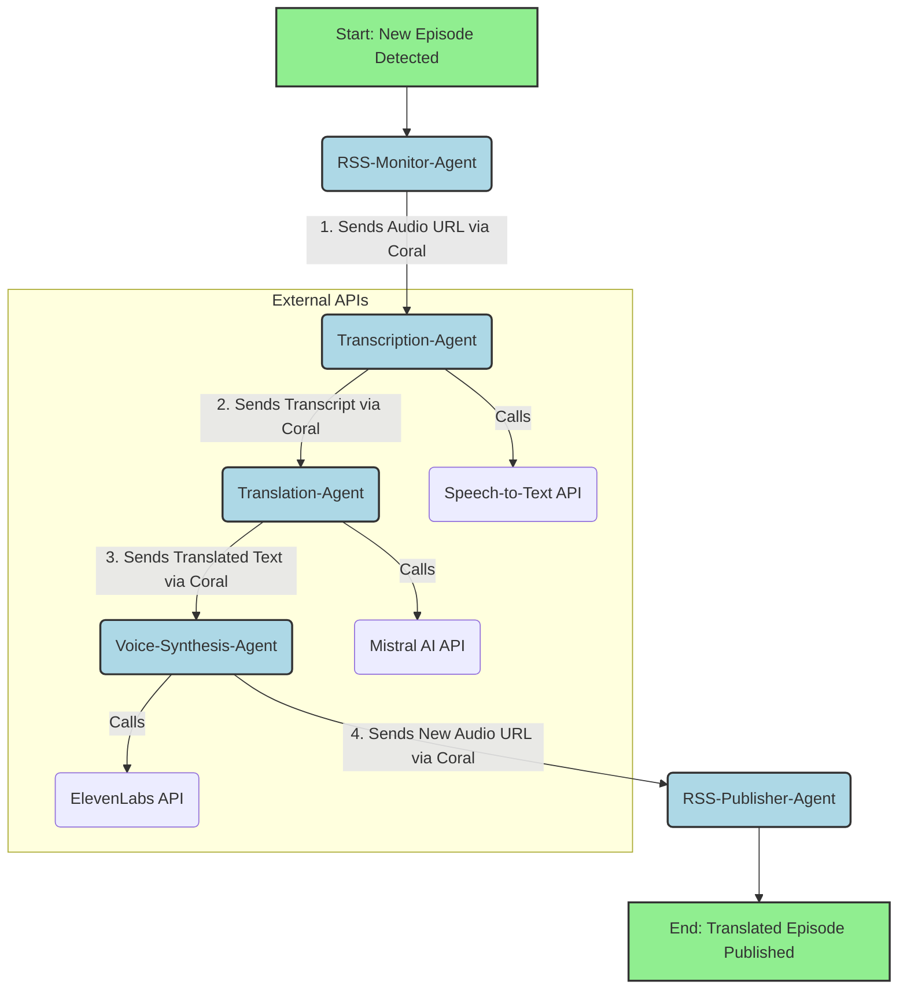

# 🏓 Agent Ping Pong with Coral Protocol
This is the stub project for **Agent Ping Pong**, created for the Internet of Agents Hackathon.  
The goal is to start simple and then extend it using **Coral Protocol** to connect multiple agents.

-----
#  🎙️Global Podcaster App

### **Global Podcaster: Breaking language barriers in podcasting**

What if your podcast could instantly reach millions of new listeners in Japan, Spain, or Germany, all while speaking in **your own authentic voice**? Global Podcaster is a revolutionary platform that breaks the language barrier for content creators, turning your local podcast into a global phenomenon. 


We solve a major problem for creators: reaching international audiences is expensive, time-consuming, and often results in robotic, impersonal dubbing. Global Podcaster changes everything with a seamless, AI-powered workflow.

## App Overview
* **Track**: App Builder
* **Problem**: Podcasts have a global audience, but language barriers limit their reach. Dubbing a podcast is expensive and time-consuming.
* **Solution**: A web app where a podcaster can submit their RSS feed. The app automatically fetches new episodes, transcribes them, translates the text into a target language, and then uses a clone of the host's voice to generate a fully translated audio episode. The new translated podcast gets its own RSS feed.
* **Tech Stack**:
	* **Coral Protocol**: To orchestrate the entire pipeline: an "RSS Fetch Agent," a "**Transcription Agent**," a "**Translation Agent**," and a "**Voice Synthesis Agent**."
    * **ElevenLabs**: The star of the show for the voice cloning and audio generation.
    * **Mistral AI**: To provide high-quality, context-aware translations.
 
## How It Works

Simply provide your podcast's RSS feed and a short sample of your voice. Our autonomous agent network, orchestrated by **Coral Protocol**, takes over:

1.  **Listen & Transcribe:** An agent automatically detects new episodes and converts them to text.
2.  **Translate & Adapt:** The script is translated with nuanced, context-aware understanding by **Mistral AI**.
3.  **Recreate & Publish:** Here's the magic. Using **ElevenLabs'** cutting-edge technology, we regenerate the entire episode in the new language, perfectly cloned in *your voice*.

The result is a new, translated RSS feed, ready for distribution. It's not just a translation; it's your show, for a new culture, with the personality and trust that only your voice can provide.

## Key Features

* **Fully Automated:** Set it up once and new episodes are translated as they're released.
* **Authentic Voice Cloning:** Maintain your brand and connection with your audience.
* **Multi-Language Support:** Instantly create versions for multiple new markets.
* **Seamless Distribution:** Get a simple RSS feed for every language, compatible with all major podcast platforms.

## The Vision

Global Podcaster is more than a tool; it's a bridge connecting creators and cultures. We are building a world where great ideas and compelling stories are no longer limited by language, empowering every podcaster to speak to the world.

-----

### 1\. User Flow: From the Podcaster's Perspective

This describes the journey a user (the podcaster) would take when interacting with the app.

**Step 1: Onboarding & Setup (One-time action)**

1.  **Sign Up:** The podcaster creates an account on the web application.
2.  **Submit RSS Feed:** On their dashboard, they submit the public RSS feed URL of their original podcast (e.g., their Spotify or Apple Podcasts feed).
3.  **Voice Cloning:**
      * The app prompts the podcaster to provide a voice sample for cloning.
      * The simplest way is an uploader where they can provide a 1-5 minute MP3 file of them speaking clearly with no background noise.
      * The app sends this sample to **ElevenLabs** to create a unique voice clone and stores the resulting Voice ID associated with the user's account.
4.  **Select Languages:** The podcaster chooses one or more target languages they want their podcast translated into (e.g., Spanish, French, German).
5.  **Receive New Feed URL:** The system immediately generates a new, unique RSS feed URL for each selected language and displays it on the dashboard. This feed will be empty at first, but the podcaster can already submit it to podcasting platforms.

**Step 2: Automated Episode Processing (Ongoing)**

1.  **Detection:** The application's backend automatically checks the podcaster's original RSS feed periodically (e.g., every hour).
2.  **Processing:** When it detects a new episode, the entire agent pipeline is triggered automatically.
3.  **Notification:** Once the translation is complete (this could take several minutes depending on the episode length), the podcaster receives an email notification: "Your new episode of '[Podcast Name] - Spanish Edition' is now live\!"
4.  **Distribution:** The newly generated, translated episode is automatically added to the corresponding translated RSS feed, making it available on all platforms where that new feed has been added.
-----

## 2\. Architecture Diagram

This diagram provides a high-level overview of the entire system, showing how the user, frontend, backend, agents, and external services all interact.



Of course. Let's break down the **"Global Podcaster" App** into a detailed plan, covering user flows, specific agent tasks, and the overall application architecture. This will serve as a comprehensive blueprint for building the project during the hackathon.

-----


### Application Architecture

This is how all the pieces fit together.

**Components:**

1.  **Frontend (Client-Side):**

      * **Technology:** A simple static web app (e.g., built with React, Vue, or basic HTML/CSS/JS).
      * **Responsibilities:** User registration/login, dashboard UI, form for submitting RSS feed, voice sample uploader, displaying the translated RSS feed URLs and episode statuses.
      * **Hosted On:** Vercel, Netlify, or similar.

2.  **Backend (Orchestrator & API):**

      * **Technology:** A lightweight server (e.g., Node.js with Express, or Python with Flask).
      * **Responsibilities:**
          * Manages user authentication and data.
          * Provides API endpoints for the frontend.
          * **Acts as the primary client for Coral Protocol.** When a new episode is found, this backend is what initiates the first job in the Coral network.
          * Serves the generated XML RSS feed files.
      * **Database:** A simple DB (e.g., Supabase, Firebase, or even SQLite for a hackathon) to store user info, RSS feeds, voice IDs, and job statuses.

3.  **Agent Services (The Workers):**

      * **Technology:** Each of the 5 agents described above is deployed as a separate, lightweight service. Serverless functions (e.g., Vercel Functions, AWS Lambda, Google Cloud Functions) are *perfect* for this.
      * **Responsibilities:** Each agent does only its one specific job. They are stateless and only communicate with each other via the **Coral Protocol** network.

4.  **External APIs (The Brains):**

      * **Mistral AI:** For high-quality text translation.
      * **ElevenLabs:** For the core voice cloning and text-to-speech synthesis.
      * **AI/ML API (or similar):** For audio transcription.

This architecture is robust, scalable, and perfectly aligns with the theme of the "Internet of Agents." It showcases a real, working product built on a foundation of secure, interoperable, and collaborative agents orchestrated by **Coral Protocol**.

-----

## 3\. Agent Flow Diagram

This diagram shows the step-by-step pipeline of how a new podcast episode is processed. The entire flow is orchestrated by **Coral Protocol**, which passes a job from one specialized agent to the next until the process is complete.



### **Flow Breakdown:**

1.  **`RSS-Monitor-Agent`** detects a new episode and initiates the workflow by passing the original audio URL to the next agent.
2.  **`Transcription-Agent`** receives the audio, converts it to text using a Speech-to-Text API, and passes the resulting transcript onward.
3.  **`Translation-Agent`** takes the transcript, translates it using **Mistral AI**, and sends the translated text to the synthesis agent.
4.  **`Voice-Synthesis-Agent`** uses the podcaster's cloned voice on **ElevenLabs** to convert the translated text into a new audio file.
5.  **`RSS-Publisher-Agent`** takes the final audio file URL and all the translated metadata (title, description) and updates the new, language-specific RSS feed.

-----

## **Getting Started**

### Manual Setup
> only the first time
#### Clone the Coral Multi-Agent Demo repository:
```bash
git clone https://github.com/Coral-Protocol/Multi-Agent-Demo coral
cd coral
```
#### Install dependencies
```bash
./check-dependencies.sh
```

### (Optional) Install ngrok in codespace
> Only if you want to make the Coral Server and Coral Discovery URLs public so that the entire team uses the same Coral server.
#### Install ngrok
```bash
curl -s https://ngrok-agent.s3.amazonaws.com/ngrok.asc | sudo tee /etc/apt/trusted.gpg.d/ngrok.asc >/dev/null
echo "deb https://ngrok-agent.s3.amazonaws.com buster main" | sudo tee /etc/apt/sources.list.d/ngrok.list
sudo apt update
sudo apt install ngrok
```

#### ngrok authentication

```bash
# Register on: ngrok.com and copy your authtoken.
ngrok config add-authtoken YOUR_AUTHTOKEN
```

### Start Coral server and studio
In one terminal, start `coral server`:
```bash
cd coral
./start-server.sh
```

In other terminal, start `coral studio`:
```bash 
cd coral
./start-studio.sh
```

#### (Optional) Expose coral server port
> Only for external access
```bash
ngrok http 5555
```
> use the public address to conect the server on `Coral Discovery`

### Nota importante para Coral Studio y servidores públicos

Si necesitas conectar Coral Studio a un servidor Coral expuesto mediante HTTPS (por ejemplo, usando ngrok), debes permitir que el campo de host acepte URLs completas (con http o https). Por defecto, Coral Studio solo usaba http, lo que causaba errores de "mixed content" en navegadores modernos.

**Solución aplicada:**

En el archivo `coral/coral-studio/src/lib/components/server-switcher.svelte`, se ha modificado la línea que realiza la petición de test de conexión:

**Antes:**
```js
const res = await fetch(`http://${host}/api/v1/registry`);
```

**Después:**
```js
// Si el host ya incluye http o https, úsalo tal cual; si no, añade http:// por compatibilidad retro.
let url = host.startsWith('http://') || host.startsWith('https://')
	? host
	: `http://${host}`;
const res = await fetch(`${url}/api/v1/registry`);
```

Esto permite introducir la URL completa (por ejemplo, `https://xxxx.ngrok-free.app`) al añadir un server en Coral Studio, solucionando problemas de seguridad y permitiendo conexiones remotas seguras.

**Cambio adicional necesario:**

En el archivo `coral/coral-studio/src/lib/components/app-sidebar.svelte`, también es necesario modificar las llamadas al registry y a las sesiones para que usen el protocolo correcto (http o https) según lo introducido en el host.

**Antes:**
```js
const agents = (await fetch(`http://${sessCtx.connection.host}/api/v1/registry`).then((res) => res.json())) as RegistryAgent[];
const sessions = (await fetch(`http://${sessCtx.connection.host}/api/v1/sessions`).then((res) => res.json())) as string[];
```

**Después:**
```js
let url = sessCtx.connection.host.startsWith('http://') || sessCtx.connection.host.startsWith('https://')
	? sessCtx.connection.host
	: `http://${sessCtx.connection.host}`;
const agents = (await fetch(`${url}/api/v1/registry`).then((res) => res.json())) as RegistryAgent[];
const sessions = (await fetch(`${url}/api/v1/sessions`).then((res) => res.json())) as string[];
```

Esto asegura que todas las llamadas al registry y a las sesiones respeten el protocolo introducido, evitando errores de mixed content y permitiendo conexiones seguras.

**Cambio adicional para la creación de sesiones:**

En el archivo `coral/coral-studio/src/lib/components/dialogs/create-session.svelte`, también es necesario modificar la llamada para crear sesiones para que use el protocolo correcto (http o https) según lo introducido en el host.

**Antes:**
```js
const res = await fetch(`http://${ctx.connection.host}/sessions`, { ... });
```

**Después:**
```js
let url = ctx.connection.host.startsWith('http://') || ctx.connection.host.startsWith('https://')
	? ctx.connection.host
	: `http://${ctx.connection.host}`;
const res = await fetch(`${url}/sessions`, { ... });
```

Esto garantiza que la creación de sesiones también respete el protocolo introducido, evitando errores de mixed content y permitiendo conexiones seguras.

**Cambio adicional para WebSocket seguro:**

En el archivo `coral/coral-studio/src/lib/session.svelte.ts`, es necesario modificar la construcción de la URL del WebSocket para que use `wss://` si la página está en HTTPS.

**Antes:**
```js
this.socket = new WebSocket(
	`ws://${host}/debug/${appId}/${privacyKey}/${session}/?timeout=10000`
);
```

**Después:**
```js
const wsProtocol = window.location.protocol === 'https:' ? 'wss://' : 'ws://';
this.socket = new WebSocket(
	`${wsProtocol}${host}/debug/${appId}/${privacyKey}/${session}/?timeout=10000`
);
```

Esto evita errores de seguridad en navegadores modernos y permite la conexión de Coral Studio a través de HTTPS.

**Corrección final para WebSocket seguro:**

En el archivo `coral/coral-studio/src/lib/session.svelte.ts`, es necesario eliminar cualquier prefijo `http://` o `https://` del host antes de anteponer `wss://` o `ws://` al construir la URL del WebSocket.

**Antes:**
```js
const wsProtocol = window.location.protocol === 'https:' ? 'wss://' : 'ws://';
this.socket = new WebSocket(
	`${wsProtocol}${host}/debug/${appId}/${privacyKey}/${session}/?timeout=10000`
);
```

**Después:**
```js
let cleanHost = host.replace(/^https?:\/\//, '');
const wsProtocol = window.location.protocol === 'https:' ? 'wss://' : 'ws://';
this.socket = new WebSocket(
	`${wsProtocol}${cleanHost}/debug/${appId}/${privacyKey}/${session}/?timeout=10000`
);
```

Esto evita URLs mal formadas como `wss://https//...` y garantiza la compatibilidad con servidores públicos y entornos seguros.


### If you are using codespaces but do not want to use ngrok
- Copy the files in /temp to the corresponding locations in /coral, overwriting the existing ones.
- You must make the coral server and coral studio ports public.
- Then, in the coral studio console, use the public address of the coral server.

### 🔑 API Keys and Environment Variables
For the transcription agent to work with Deepgram, you need a valid API key. Create a `.env` file in the root of the project with the following content:

```env
DEEPGRAM_API_KEY=your_deepgram_api_key_here
```
This variable will be automatically read by the transcription agent. If it is missing or incorrect, transcription will fail.

### Translation Agent: Mistral AI API Key

To use the translation agent with Mistral AI, you need a valid API key. Add the following line to your `.env` file in the root of the project:

```env
MISTRAL_API_KEY=your_mistral_api_key_here
```

This variable will be automatically read by the translation agent. If it is missing or incorrect, translation will fail.

### How to run
1. Open in GitHub Codespaces / devcontainer or locally
2. Install dependencies: `pip install -r requirements.txt`
3. Run simulation: `echo '{"sender": "user", "receiver": "orchestrator", "content": "https://feeds.megaphone.fm/sciencevs"}' | python3 agents/agent.py`
